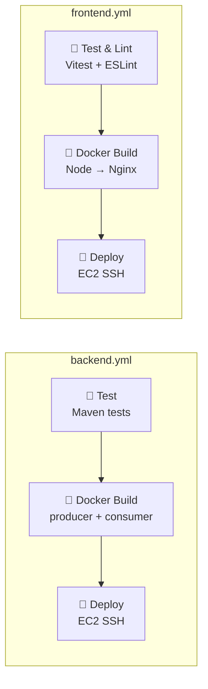

# CI/CD Workflows

This folder contains the GitHub Actions workflows responsible for Continuous Integration and Continuous Deployment (CI/CD) of the Sofkianos MVP application.

Both workflows run automatically on every push and pull request event.
They apply to all branches:

main
develop
feature/**

If any test fails, the workflow must stop and block integration (i.e., prevent merging).
The workflow should not run when changes are only in documentation or non‑code files (e.g., .md, .txt, or similar).
It should run only when code files are modified.

## 🏗️ Architecture

### 1. Backend Workflow (`backend.yml`)
Responsible for building, testing, and deploying the Java-based microservices (`producer-api` and `consumer-worker`).

- **Trigger Conditions**: Runs when there are changes in `producer-api/`, `consumer-worker/`, or Docker configuration files. 
- **File Filtering**: Ignores documentation and non-code files (e.g., `.md`, `.txt`, `.png`).
- **Jobs**:
  1. **Test**: Runs Maven unit and integration tests (using Testcontainers). Fail-fast strategy.
  2. **Docker Build**: Builds separate Docker images for producer and consumer, caching layers, and pushing to Docker Hub.
  3. **Deploy**: SSHs into the AWS EC2 instance, pulls the new images, and restarts only the backend containers via Docker Compose. (Only triggers on pushes to the `main` branch).

### 2. Frontend Workflow (`frontend.yml`)
Responsible for building, testing, and deploying the React frontend application.

- **Trigger Conditions**: Runs when there are changes in the `frontend/` directory.
- **File Filtering**: Ignores documentation and non-code files.
- **Jobs**:
  1. **Test & Lint**: Runs ESLint to enforce code quality and Vitest for unit testing. Fail-fast strategy.
  2. **Docker Build**: Builds the frontend image using a multi-stage process (Node for building, Nginx for serving), caching layers, and pushing to Docker Hub.
  3. **Deploy**: SSHs into the AWS EC2 instance, pulls the new frontend image, and restarts only the frontend container via Docker Compose. (Only triggers on pushes to the `main` branch).

### 3. End-to-End Workflow (`ci.yml`)
An overarching CI pipeline that performs full-stack verification.

- **Trigger Conditions**: Runs on pushes and pull requests to `main`, `develop`, and `feature/**` branches.
- **File Filtering**: Ignores documentation and non-code files.
- **Jobs**:
  1. **Backend Tests**: Executes Maven tests.
  2. **Frontend Tests**: Executes Vitest unit tests.
  3. **E2E Tests**: Spins up the entire stack inside the GitHub runner (including RabbitMQ) and runs the Playwright End-to-End test suite. This job waits for the backend and frontend tests to pass before executing.

## 🔑 Required Secrets

To function correctly, these workflows require the following repository secrets to be configured in GitHub:

| Secret | Purpose |
| ------ | ------- |
| `DOCKERHUB_USERNAME` | Your Docker Hub username. |
| `DOCKERHUB_TOKEN` | An access token generated from Docker Hub. |
| `EC2_HOST` | The public IP or DNS hostname of your AWS EC2 instance. |
| `EC2_USER` | The SSH user for the EC2 instance (usually `ec2-user`). |
| `EC2_SSH_KEY` | The private SSH key (PEM format) required to connect to the EC2 instance. |
