# HANDOVER REPORT — SofkianOS MVP

**Documento:** Análisis Integral del Sistema Heredado  
**Fecha:** 18 de Febrero de 2026  
**Versión:** 1.0  
**Destinatarios:** Equipo de Mantenimiento, Nuevos Desarrolladores, Arquitectos de Software

---

## Tabla de Contenidos

- [1. Descripción General](#1-descripción-general)
- [2. Arquitectura del Sistema](#2-arquitectura-del-sistema)
- [3. Flujo de Trabajo](#3-flujo-de-trabajo)
- [4. Dependencias y Configuración](#4-dependencias-y-configuración)


---

## 1. Descripción General

### 1.1 ¿Qué es el Sistema?

**SofkianOS** es una plataforma digital diseñada para **automatizar la cultura de reconocimiento y recompensas** dentro de una organización distribuida geográficamente. El nombre es un acrónimo que combina **Sofkian** (nuestra esencia empresarial) con **OS** (Sistema Operativo de Kudos).

### 1.2 Propósito Principal

El sistema transforma la **identidad Sofkiana en Kudos tangibles**. Un "Kudo" es un reconocimiento formal que un empleado puede enviar a un compañero para celebrar un logro, contribución o comportamiento destacado. El término proviene del griego antiguo *kŷdos*, que significa honor, reconocimiento y prestigio.

**Valor de negocio:**
- Fortalece la cultura organizacional en equipos distribuidos
- Proporciona reconocimiento instantáneo sin trabajador manual
- Implementa gamificación justa a través de categorías y puntos
- Procesa miles de reconocimientos de forma asincrónica sin bloqueos

### 1.3 Procesos Automatizados

| Proceso | Descripción |
|---------|-------------|
| **Envío de Kudo** | Un empleado accede a la interfaz web, completa un formulario (remitente, destinatario, categoría, mensaje) y envía su reconocimiento. |
| **Validación Inmediata** | El sistema valida la estructura del Kudo en tiempo real, rechazando auto-reconocimientos y validando datos obligatorios. |
| **Publicación Asincrónica** | La API acepta la solicitud (HTTP 202) y publica el evento a RabbitMQ sin bloquear. El usuario obtiene confirmación instantánea. |
| **Procesamiento en Background** | Un worker consumidor procesa el Kudo en segundo plano: calcula puntos, aplica reglas de gamificación, y persiste en la base de datos. |
| **Persistencia Final** | Los Kudos se almacenan en PostgreSQL con trazabilidad completa, incluyendo timestamps y meditaciones de validación. |

### 1.4 Usuarios del Sistema

| Rol | Descripción | Responsabilidades |
|-----|-------------|-------------------|
| **Empleado Sofka** | Usuario final del sistema | Enviar Kudos, recibir reconocimientos, visualizar su perfil |
| **Administrador (Futuro)** | Gestor del sistema | Configurar categorías, revisar Kudos rechazados, generar reportes |
| **API Consumer (Interno)** | Otros sistemas | Integración futura con sistemas de RRHH o nómina |

### 1.5 Alcance Actual

**En Producción:**
- ✅ Envío de Kudos desde interfaz web
- ✅ Validación de datos de entrada
- ✅ Procesamiento asincrónico con RabbitMQ
- ✅ Persistencia de datos en PostgreSQL (futuro)

**No Implementado (Roadmap):**
- 🔄 Autenticación y autorización
- 🔄 Panel de administración
- 🔄 Reportes y analytics
- 🔄 Notifications en tiempo real
- 🔄 Aplicación móvil

---

## 2. Arquitectura del Sistema

### 2.1 Visión General Arquitectónica

SofkianOS implementa una **arquitectura de microservicios orientada a eventos** usando el patrón **Event-Driven Asynchronous Pipeline**. El diseño garantiza que el sistema pueda procesar miles de reconocimientos simultáneamente sin bloqueos o cuellos de botella.

```
┌─────────────────────────────────────────────────┐
│           SOFKIANOS - SYSTEM ARCHITECTURE        │
├─────────────────────────────────────────────────┤
│                                                 │
│  [Empleado Sofka]                              │
│          │                                      │
│          │ (Navega a la interfaz)              │
│          ▼                                      │
│  ┌─────────────────────┐                       │
│  │  SofkianOS Web      │                       │
│  │  (React + Vite)     │                       │
│  │  Port: 5173         │                       │
│  └──────────┬──────────┘                       │
│             │                                  │
│             │ POST /api/v1/kudos (JSON)       │
│             ▼                                  │
│  ┌─────────────────────┐                       │
│  │  Producer API       │                       │
│  │  (Spring Boot)      │  • Validación         │
│  │  Port: 8082         │  • Publicación        │
│  └──────────┬──────────┘                       │
│             │                                  │
│             │ AMQP: Publish Event             │
│             ▼                                  │
│  ┌─────────────────────┐                       │
│  │    RabbitMQ         │                       │
│  │  (Message Broker)   │  • Desacople          │
│  │  Port: 5672 / 15672 │  • Persistencia       │
│  └──────────┬──────────┘                       │
│             │                                  │
│             │ AMQP: Consume Event             │
│             ▼                                  │
│  ┌─────────────────────┐                       │
│  │ Consumer Worker     │                       │
│  │  (Spring Boot)      │  • Lógica Kudo        │
│  │  Port: 8081         │  • Cálculo Puntos     │
│  └──────────┬──────────┘                       │
│             │                                  │
│             │ Persist Data                    │
│             ▼                                  │
│  ┌─────────────────────┐                       │
│  │   PostgreSQL DB     │                       │
│  │   (Futura)          │  • Persistencia       │
│  └─────────────────────┘                       │
│                                                 │
└─────────────────────────────────────────────────┘
```

### 2.2 Componentes Principales

#### **Frontend: SofkianOS Web**

**Tecnología:** React 19.2.0 + TypeScript + Vite  
**Ubicación:** `/frontend`  
**Puerto:** 5173 (desarrollo), nginx reverse proxy (producción)

**Responsabilidades:**
- Interfaz de usuario para envío de Kudos
- Landing page con descripción del sistema
- Validación de formularios en el cliente
- Gestión de estado global con Zustand

**Estructura:**



```mermaid
flowchart LR
  %% Front-end Architecture (React + TypeScript + Vite)
  %% GitHub Mermaid-friendly: simple shapes, clear subgraphs, labeled flows.
  classDef layer stroke-width:1.2px;
  classDef ext stroke-dasharray: 4 2,stroke-width:1.2px;

  U["User / Browser"]:::layer

  subgraph Runtime["UI & Runtime"]
    direction TB
    Entry["App Bootstrap (Vite + React)"]:::layer
    Router["Routing (React Router)"]:::layer
    Pages["Pages / Views (LandingPage, KudosPage)"]:::layer
    UI["Reusable Components (Navbar, KudoForm, common/*, landing/*)"]:::layer
  end

  subgraph Logic["Application Logic"]
    direction TB
    Hooks["Custom Hooks (data/*, forms/*, landing/*, ui/*)"]:::layer
    Forms["Forms & Validation (React Hook Form + Zod schemas)"]:::layer
  end

  subgraph State["State Management"]
    direction TB
    Store["Zustand Stores (appStore, userStore)"]:::layer
  end

  subgraph Integration["API & Integration"]
    direction TB
    Services["Service Layer (API wrappers / use-cases)"]:::layer
    HTTP["HTTP Client (Axios)"]:::layer
    Utils["Utilities (error mapping / helpers)"]:::layer
  end

  API["Producer API (POST /api/v1/kudos)"]:::ext

  U -->|loads SPA| Entry
  Entry --> Router --> Pages
  Pages -->|compose| UI

  Pages -->|invoke| Hooks
  UI -->|submit user input| Forms
  Forms -->|validated payload| Hooks

  Hooks <--> |read/write state| Store
  Pages <--> |render from state| Store

  Hooks -->|call| Services --> HTTP -->|JSON over HTTP| API
  API -->|202 Accepted / errors| HTTP --> Utils --> Store
```

**Componentes Clave:**
- `KudoForm.tsx` — Formulario para enviar Kudos con validación
- `Navbar.tsx` — Barra de navegación
- `LandingPage.tsx` — Página de inicio con información del sistema
- `KudosPage.tsx` — Página principal de la aplicación

#### **Backend: Producer API**

**Tecnología:** Spring Boot 3.3.5 + Java 21  
**Ubicación:** `/producer-api`  
**Puerto:** 8082

**Responsabilidades:**
- Exponer endpoint REST `POST /api/v1/kudos`
- Validar integridad de datos de entrada
- Publicar eventos a RabbitMQ
- Retornar respuesta HTTP 202 (Aceptado)
- Exponer endpoint de salud `/health`
- Documentar API con Swagger/OpenAPI

**Stack Tecnológico:**
- Spring Boot Web (REST Controller)
- Spring AMQP (Configuración RabbitMQ)
- Spring Validation (Bean Validation)
- Lombok (Reducción de boilerplate)
- SpringDoc OpenAPI (Documentación Swagger)


**Estructura:**


```mermaid
flowchart LR
  classDef svc stroke-width:1px;
  classDef ext stroke-dasharray: 4 2,stroke-width:1px;

  U["User / Browser"]:::ext
  FE["Frontend SPA (React, Router, Zustand, Forms)"]:::ext

  subgraph PRODUCER["Producer API (Spring Boot)"]
    direction TB
    PC["KudosController (REST)"]:::svc
    PV["Bean Validation"]:::svc
    PS["KudoService (domain orchestration)"]:::svc
    PP["RabbitMQ Publisher (AMQP)"]:::svc
  end

  subgraph BROKER["RabbitMQ (Messaging)"]
    direction TB
    EX["Exchange: kudos.exchange"]:::svc
    Q["Queue: kudos.queue"]:::svc
    DLQ["Dead Letter Queue: kudos.dlq"]:::svc
  end

  subgraph CONSUMER["Consumer Worker (Spring Boot)"]
    direction TB
    CL["KudoEventListener (RabbitListener)"]:::svc
    CP["KudoProcessingService"]:::svc
    CG["GamificationStrategy"]:::svc
    CR["KudoRepository (JPA)"]:::svc
  end

  DB["PostgreSQL (persistence)"]:::svc

  U -->|"uses"| FE
  FE -->|"POST /api/v1/kudos (JSON)"| PC
  PC --> PV --> PS -->|"build KudoEvent"| PP
  PP -->|"publish (AMQP)"| EX -->|"route"| Q
  Q -->|"consume (AMQP)"| CL --> CP --> CG --> CR -->|"persist"| DB
  CP -->|"on processing error"| DLQ
  PRODUCER -.->|"returns quickly"| FE
  PC -->|"HTTP 202 Accepted"| FE
```

**Producer API:**
- Recibe `POST /api/v1/kudos`, valida (`Bean Validation`) y mapea el request a un evento (`KudoEvent`).
- Publica el evento en RabbitMQ vía AMQP (`kudos.exchange` → `kudos.queue`).
- Retorna `HTTP 202 Accepted` para mantener el flujo no-bloqueante (procesamiento asincrónico).
- Endpoints operativos recomendados: `GET /actuator/health` y `GET /actuator/prometheus`.

**Consumer Worker:**
- Consume mensajes desde `kudos.queue` con `@RabbitListener`.
- Ejecuta la lógica de negocio (gamificación/cálculo de puntos) y persiste el resultado (opcional).
- En éxito: `ack` del mensaje. En fallo: `nack` y enrutamiento a DLQ o a estrategia de reintentos (según política).
- Buenas prácticas: idempotencia (por `messageId`), manejo de duplicados, y métricas/health checks.

**RabbitMQ:**
- Actúa como broker para desacoplar Producer y Consumer (AMQP 5672, Management UI 15672).
- Topología esperada: `Exchange (kudos.exchange)` + `Queue (kudos.queue)` + `DLQ (kudos.dlq)`.
- En producción: habilitar persistencia (volúmenes), políticas de DLX/TTL para backoff, y HA si se requiere (cluster/quorum queues).

### 2.3 Stack Tecnológico Detallado

| Capa | Componente | Versión | Justificación |
|------|-----------|---------|---------------|
| **Frontend** | React | 19.2.0 | Librería moderna, componentes reactivos, gran comunidad |
| | TypeScript | 5.9.3 | Type safety en tiempo de compilación |
| | Vite | 7.2.4 | Build tool ultrarrápido, HMR eficiente |
| | Tailwind CSS | 3.4.19 | Utility-first CSS, escalable, bajo overhead |
| | React Hook Form | 7.71.1 | Formularios performantes, bajo re-render |
| | Zod | 4.3.6 | Validación esquemas TypeScript-first |
| | Zustand | 5.0.11 | State management ligero (<3KB minified) |
| | Axios | 1.13.4 | HTTP client con interceptores |
| **Backend** | Spring Boot | 3.3.5 | Framework Java estándar de industria |
| | Java | 21 | LTS, features modernas, rendimiento |
| | Maven | (implícito) | Build tool, gestión de dependencias |
| | Lombok | 1.18+ | Reducción boilerplate (getters, setters, builders) |
| | Spring AMQP | 3.3.5 | Integración RabbitMQ |
| | Spring Data JPA | 3.3.5 | Abstracción persistencia |
| | SpringDoc OpenAPI | 2.6.0 | Documentación automática API |
| | TestContainers | (test) | Tests integración con contenedores reales |
| **Infraestructura** | Docker | Multi-stage | Containerización, reproducibilidad |
| | Docker Compose | 3.8 | Orquestación local |
| | RabbitMQ | 3-management | Message broker asincrónico |
| | PostgreSQL | 15+ | Base datos relacional |
| | Terraform | (aws/) | Infraestructura como código (AWS) |
| | Nginx | (frontend) | Reverse proxy, servir archivos estáticos |
| **DevOps** | Dozzle | latest | Visor de logs en tiempo real |
| | Vercel | (frontend) | Hosting frontend en producción |
| | AWS EC2 | (backend) | Hosting backend en producción |

### 2.4 CI/CD Pipeline

**Sistema Actual:** GitHub Actions + Jenkins 

**Archivos de Configuración:**
- `.github/workflows/ci.yml` — Workflow automático de GitHub Actions
- `frontend/ci/Jenkinsfile` — Pipeline Jenkins para frontend

**Etapas del Pipeline:**
1. **Checkout:** Clonar repositorio
2. **Build:** Compilar código (Maven para Java, npm para React)
3. **Test:** Ejecutar suite de tests
4. **Quality:** Análisis de código, cobertura
5. **Docker Build:** Construir imágenes Docker
6. **Push Registry:** Subir a Docker registry
7. **Deploy:** Desplegar a AWS/Vercel

Un problema identificado es que en Github Actions solo hay un workflow totalmente distinto al especificado.
Por lo que, el archivo ci.yml no se está ejecutando .

Actions se utiliza para la integración continua y pruebas automatizadas dentro del propio repositorio, 
mientras que el Jenkinsfile expresa un pipeline separado (compilación + creación de imagen Docker + despliegue) 
destinado a ejecutarse en un servidor Jenkins.

### 2.5 Diagramas de Flujo de Datos

#### Flujo C1 — Contexto del Sistema
```
┌──────────────────┐
│   Sofka Employee │
└────────┬─────────┘
         │
         │ Uses Web Interface
         │
         ▼
    ┌─────────────────────────┐
    │    SofkianOS System     │
    │ (All Components Below)  │
    │                         │
    │ Frontend + API +        │
    │ RabbitMQ + Consumer +   │
    │ Database                │
    └─────────────────────────┘
```

#### Flujo C2 — Contenedores
```
Frontend                Producer API              Consumer Worker
(React/Vite)           (Spring Boot)             (Spring Boot)
    │                        │                         │
    └────────┬────────────────┬─────────────────────────┘
             │
      HTTP 202 Accepted      AMQP (RabbitMQ)      Database
             │                    │                   │
             └─────────────────────┼───────────────────┘
```

#### Flujo de Un Kudo (End-to-End)

```
1. ENTRADA (Frontend)
  └─ Usuario completa formulario y presiona "Enviar"
    Fields: from, to, category, message

2. VALIDACIÓN (Frontend)
  └─ Zod valida el esquema
  └─ React Hook Form evita auto-reconocimientos
  └─ Axios prepara POST hacia API

3. TRANSMISIÓN (HTTP)
  └─ Frontend envía:
    POST http://producer-api:8082/api/v1/kudos
    Content-Type: application/json
    Body: { from, to, category, message }

4. RECEPCIÓN (Producer API)
  └─ KudosController recibe request
  └─ Spring Validation verifica campos
  └─ KudoService.createKudo() orquesta lógica
    - Validar que no sea auto-Kudo
    - Mapper a KudoEvent DTO
    - RabbitMqPublisher publica a RabbitMQ

5. RESPUESTA (HTTP)
  └─ Retorna HTTP 202 Accepted
  └─ Frontend muestra confirmación al usuario
  └─ Usuario NO espera a completar procesamiento

6. COLA (RabbitMQ)
  └─ Mensaje KudoEvent persiste en kudos.queue
  └─ Exchange: kudos.exchange
  └─ Routing Key: kudo.created
  └─ DLQ habilitado para errores

7. CONSUMO (Consumer Worker)
  └─ KudoEventListener consume del queue
  └─ Deserializa KudoEvent automáticamente
  └─ KudoProcessingService orquesta:
    - Aplicar reglas de gamificación
    - Calcular puntos según categoría
    - Validar integridad de datos

8. PERSISTENCIA (Base de Datos)
  └─ KudoRepository.save() persiste en PostgreSQL
  └─ Timestamp de procesamiento registrado
  └─ Trazabilidad completa disponible

9. ERROR HANDLING
  └─ Si hay excepción en paso 7-8:
    - Mensaje reenviado a DLQ
    - No causa cascada; API ya respondió
    - Admin puede revisar DLQ y reintentsr
```

---

## 3. Flujo de Trabajo

### 3.1 Flujo Principal: Envío de Kudo

#### Paso 1: Acceso a la Interfaz
- Usuario navega a `https://sofkianos-mvp.vercel.app/`
- Frontend se carga desde Vercel (hospedaje estático)
- Usuario ve landing page con descripción del sistema

#### Paso 2: Navegación a Formulario
- Usuario hace clic en "Enviar Kudo" o accede directamente a `/app`
- React Router navega a `KudosPage` (antes: binario `isAppView`)
- La página muestra formulario reactivo

#### Paso 3: Completar Formulario
```
┌────────────────────────────────┐
│   FORMULARIO KUDO              │
├────────────────────────────────┤
│  De (Remitente):               │
│  [Selector: Christopher Pallo] │  (hardcoded, futuro: BD)
│                                │
│  Para (Destinatario):          │
│  [Selector: Elian Condor]      │
│                                │
│  Categoría:                    │
│  [Dropdown: TEAMWORK]          │  (enum validado)
│                                │
│  Mensaje:                      │
│  [Texto libre]                 │
│                                │
│  [Enviar] [Cancelar]           │
└────────────────────────────────┘
```

#### Paso 4: Validación en Cliente
- **React Hook Form** valida formulario:
  - Campos obligatorios no vacíos
  - Longitud de mensaje (máx 1000 caracteres)
  - Remitente ≠ Destinatario (evita auto-Kudos)
- **Zod Schema** (`kudoFormSchema.ts`) tipado:
  ```typescript
  const KudoFormSchema = z.object({
    from: z.string().min(1, "Remitente requerido"),
    to: z.string().min(1, "Destinatario requerido"),
    category: z.enum(["TEAMWORK", "INNOVATION", "EXCELLENCE"]),
    message: z.string().min(10).max(1000)
  }).refine(
    (data) => data.from !== data.to,
    { message: "No puedes enviarte un Kudo a ti mismo" }
  );
  ```
- Si hay errores, formulario resalta campos y muestra mensajes

#### Paso 5: Envío al Producer API
- Usuario hace clic en "Enviar"
- Frontend prepara payload JSON
- **Axios** realiza:
  ```javascript
  POST http://producer-api:8082/api/v1/kudos
  {
    "from": "Christopher Pallo",
    "to": "Elian Condor",
    "category": "TEAMWORK",
    "message": "Excelente liderazgo en el sprint"
  }
  ```
- Request tiene timeout de 5 segundos (configurable)

#### Paso 6: Procesamiento en Producer API
```
HTTP Request Recibida
    │
    ├─ KudosController.createKudo() mapea a KudoRequest
    │
    ├─ Spring Validation (@Valid, @NotBlank, etc.)
    │
    └─ KudoService.createKudo()
       ├─ Kudo.builder()
       │  ├─ Validar: from != to
       │  ├─ Validar: campos no nulos
       │  └─ Construir entidad rica con invariantes
       │
       ├─ RabbitMqPublisher.publish(KudoEvent)
       │  ├─ Mapear Kudo a KudoEvent (DTO)
       │  ├─ ObjectMapper convierte a JSON
       │  └─ RabbitTemplate envía a kudos.exchange
       │
       └─ Retornar HTTP 202 Accepted
          └─ Payload: { id: UUID, status: "PUBLISHED" }
```

#### Paso 7: Mensaje en RabbitMQ
- Mensaje llega a `kudos.queue` con metadatos:
  - Routing Key: `kudo.created`
  - Content-Type: `application/json`
  - Headers: timestamp, messageId
  - TTL: configurable (defecto: sin TTL = infinito)
  
- RabbitMQ persiste en disco (durabilidad)
- Queue espera consumidor disponible

#### Paso 8: Consumo en Consumer Worker
```
RabbitListener Detecta Evento
    │
    ├─ @RabbitListener(queues = "kudos.queue")
    │
    └─ KudoEventListener.handleKudoEvent(KudoEvent event)
       ├─ Deserializar automáticamente (Spring trata @Payload)
       │
       ├─ KudoProcessingService.processKudo()
       │  ├─ Validar integridad de datos
       │  ├─ GamificationStrategy.calculatePoints()
       │  │  └─ Retorna puntos según categoría
       │  │     TEAMWORK: 10 pts
       │  │     INNOVATION: 15 pts
       │  │     EXCELLENCE: 20 pts
       │  │
       │  └─ Crear Kudo persistible con puntos
       │
       └─ KudoRepository.save() persiste en PostgreSQL
          └─ Timestamp processed_at registrado
```

#### Paso 9: Confirmación Final al Usuario
- Frontend recibe HTTP 202
- Toast/Notificación: "¡Kudo enviado exitosamente!"
- Formulario se resetea
- Usuario puede enviar otro Kudo

#### Paso 10: Observabilidad
- **Producer API logs:**
  ```
  [INFO] POST /api/v1/kudos - from: Christopher, to: Elian
  [INFO] Kudo published to RabbitMQ with ID: 12ab34cd
  ```
- **RabbitMQ Dashboard (15672):** Cola muestra 1 mensaje
- **Consumer Worker logs:**
  ```
  [INFO] Consuming KudoEvent: ID 12ab34cd
  [INFO] Calculated points: 10 (TEAMWORK)
  [INFO] Kudo persisted with ID: uuid-1234
  ```
- **Dozzle (8888):** Logs en tiempo real de todos containers

#### Manejo de Errores

**Si la validación falla en Producer:**
```
Respuesta HTTP 400 Bad Request
{
  "error": "Validation error",
  "fields": {
    "from": "Remitente requerido"
  }
}
```

**Si RabbitMQ no está disponible:**
```
Respuesta HTTP 503 Service Unavailable
{
  "error": "Message broker unreachable"
}
Consumer API aún retorna 202 si usa fallback
```

**Si Consumer produce error:**
```
Mensaje se reenvía 3 veces (configurable)
Si sigue fallando → Dead Letter Queue (kudos.dlq)
Admin puede revisar DLQ e intentar replay manual
```

### 3.2 Flujo Secundario: Observabilidad en Tiempo Real

**Propósito:** Verificar end-to-end que un Kudo fue procesado

**Pasos:**

1. **Abrir Dozzle:** Navegar a `http://localhost:8888`
2. **Seleccionar Logs Producer API:**
   - Ver endpoint HTTP POST
   - Ver serialización a KudoEvent
   - Ver publicación a RabbitMQ
3. **Monitorear Cola RabbitMQ:**
   - Navegar a `http://localhost:15672` (guest/guest)
   - Ir a "Queues"
   - Ver "kudos.queue" con número de mensajes
4. **Seleccionar Logs Consumer Worker:**
   - Ver deserialization de mensaje
   - Ver cálculo de puntos
   - Ver persistencia en BD
5. **Verificar Transacción Completa:**
   - Si logs muestran consumo exitoso → Kudo almacenado
   - Si hay error → Revisar Dead Letter Queue en RabbitMQ UI

### 3.3 Operaciones Administrativas

#### Reiniciar Stack Completo (Desarrollo)
```bash
docker compose -f docker-compose.dev.yml down -v  # Elimina volúmenes
docker compose -f docker-compose.dev.yml up -d --build
```

#### Revisar Mensajes en Dead Letter Queue
```bash
# En RabbitMQ UI (http://localhost:15672)
1. Ir a "Queues"
2. Click en "kudos.dlq"
3. Ver mensajes rechazados
4. Expandir mensaje para ver payload JSON
5. Botón "Purge" para limpiar, o "Ack this" para ignorar
```

#### Escalar Consumer (Producción)
```bash
# En docker-compose.prod.yml, usar replicas:
services:
  consumer-worker:
    deploy:
      replicas: 3  # Procesa 3× más rápido
```

---

## 4. Dependencias y Configuración

### 4.1 Dependencias Críticas

#### Backend (Java)

| Dependencia | Versión | Propósito | Criticidad |
|-------------|---------|----------|-----------|
| **spring-boot-starter-web** | 3.3.5 | REST API, Controllers | 🔴 Crítico |
| **spring-boot-starter-amqp** | 3.3.5 | RabbitMQ integration | 🔴 Crítico |
| **spring-boot-starter-validation** | 3.3.5 | Bean Validation | 🟡 Alto |
| **spring-boot-starter-data-jpa** | 3.3.5 | Persistencia ORM | 🟡 Alto |
| **postgresql** | latest | Driver JDBC | 🟡 Alto |
| **lombok** | 1.18+ | Boilerplate reduction | 🟢 Bajo |
| **springdoc-openapi** | 2.6.0 | Swagger documentation | 🟢 Bajo |
| **testcontainers** | (test) | Integration tests | 🟢 Bajo |

#### Frontend (JavaScript)

| Dependencia | Versión | Propósito | Criticidad |
|-------------|---------|----------|-----------|
| **react** | 19.2.0 | UI library | 🔴 Crítico |
| **react-router-dom** | 7.13.0 | Client-side routing | 🔴 Crítico |
| **axios** | 1.13.4 | HTTP client | 🔴 Crítico |
| **react-hook-form** | 7.71.1 | Form management | 🟡 Alto |
| **zod** | 4.3.6 | Schema validation | 🟡 Alto |
| **zustand** | 5.0.11 | State management | 🟢 Bajo |
| **tailwindcss** | 3.4.19 | CSS framework | 🟡 Alto |
| **typescript** | 5.9.3 | Type safety | 🟡 Alto |
| **vite** | 7.2.4 | Build tool | 🟡 Alto |

#### Infraestructura

| Dependencia | Versión | Propósito | Criticidad |
|-------------|---------|----------|-----------|
| **docker** | 24.0+ | Containerización | 🔴 Crítico |
| **docker-compose** | 3.8 | Orquestación local | 🔴 Crítico |
| **rabbitmq** | 3-management | Message broker | 🔴 Crítico |
| **postgresql** | 15+ | Database | 🔴 Crítico |
| **terraform** | latest | IaC (AWS) | 🟡 Alto |
| **nginx** | latest | Reverse proxy | 🟡 Alto |

### 4.2 Configuración del Entorno

#### Archivo `.env.example`

```bash
# RabbitMQ
RABBITMQ_DEFAULT_USER=guest
RABBITMQ_DEFAULT_PASS=guest

# Base de Datos (PostgreSQL)
DB_HOST=postgres
DB_PORT=5432
DB_NAME=sofkianos_db
DB_USER=sofka_user
DB_PASSWORD=secure_password_change_in_prod

# API Config
API_PORT=8082
CONSUMER_PORT=8081
FRONTEND_URL=http://localhost:5173

# AWS (si se usa infraestructura AWS)
AWS_REGION=us-east-1
AWS_ACCESS_KEY_ID=your-key-id
AWS_SECRET_ACCESS_KEY=your-secret-key

# Email (futuro)
SMTP_HOST=smtp.gmail.com
SMTP_PORT=587
SMTP_USER=your-email@sofka.com
SMTP_PASSWORD=your-app-password
```

#### Configuración Spring Boot (Producer API)

**Archivo:** `producer-api/src/main/resources/application.properties`

```properties
# Spring
spring.application.name=producer-api
server.port=8082

# Logging
logging.level.root=INFO
logging.level.com.sofkianos=DEBUG

# RabbitMQ
spring.rabbitmq.host=${SPRING_RABBITMQ_HOST:localhost}
spring.rabbitmq.port=5672
spring.rabbitmq.username=${RABBITMQ_DEFAULT_USER:guest}
spring.rabbitmq.password=${RABBITMQ_DEFAULT_PASS:guest}

# OpenAPI/Swagger
springdoc.api-docs.path=/api-docs
springdoc.swagger-ui.path=/swagger-ui.html

# Actuator (Health Checks)
management.endpoints.web.exposure.include=health,metrics
```

#### Configuración Spring Boot (Consumer Worker)

**Archivo:** `consumer-worker/src/main/resources/application.properties`

```properties
# Spring
spring.application.name=consumer-worker
server.port=8081

# Database (PostgreSQL)
spring.datasource.url=jdbc:postgresql://${DB_HOST:localhost}:5432/${DB_NAME:sofkianos_db}
spring.datasource.username=${DB_USER:postgres}
spring.datasource.password=${DB_PASSWORD:postgres}
spring.jpa.hibernate.ddl-auto=update

# RabbitMQ
spring.rabbitmq.host=${SPRING_RABBITMQ_HOST:localhost}
spring.rabbitmq.port=5672
spring.rabbitmq.username=${RABBITMQ_DEFAULT_USER:guest}
spring.rabbitmq.password=${RABBITMQ_DEFAULT_PASS:guest}

# Logging
logging.level.com.sofkianos=DEBUG
```

#### Configuración Docker Compose (Desarrollo)

**Archivo:** `docker-compose.dev.yml`

```yaml
version: '3.8'

services:
  # RabbitMQ - Message Broker
  rabbitmq:
    image: rabbitmq:3-management
    container_name: sofkian-rabbitmq
    ports:
      - "5672:5672"      # AMQP port
      - "15672:15672"    # Management UI
    environment:
      RABBITMQ_DEFAULT_USER: guest
      RABBITMQ_DEFAULT_PASS: guest
    healthcheck:
      test: ["CMD", "rabbitmq-diagnostics", "-q", "ping"]
      interval: 10s
      timeout: 5s
      retries: 5
    networks:
      - sofkian-net

  # Producer API
  producer-api:
    build: ./producer-api
    container_name: sofkianos-producer
    ports:
      - "8082:8082"
    environment:
      SPRING_RABBITMQ_HOST: sofkian-rabbitmq
    depends_on:
      rabbitmq:
        condition: service_healthy
    networks:
      - sofkian-net

  # Consumer Worker
  consumer-worker:
    build: ./consumer-worker
    container_name: sofkianos-consumer
    ports:
      - "8081:8081"
    environment:
      SPRING_RABBITMQ_HOST: sofkian-rabbitmq
    depends_on:
      rabbitmq:
        condition: service_healthy
    networks:
      - sofkian-net

  # Frontend
  frontend:
    build: ./frontend
    container_name: sofkianos-frontend
    ports:
      - "5173:5173"
    depends_on:
      - producer-api
    networks:
      - sofkian-net

  # Log Viewer
  log-viewer:
    image: amir20/dozzle:latest
    container_name: sofkianos-log-viewer
    volumes:
      - /var/run/docker.sock:/var/run/docker.sock
    ports:
      - "8888:8080"
    networks:
      - sofkian-net

networks:
  sofkian-net:
    driver: bridge
```

#### Variables de Entorno Críticas

```bash
# ⚠️ NUNCA commitir estas credenciales a Git:
RABBITMQ_DEFAULT_USER=guest
RABBITMQ_DEFAULT_PASS=guest
DB_PASSWORD=secure_password

# Usar .env.local (excluido en .gitignore)
# O usar GitHub Secrets en CI/CD
```

### 4.3 Scripts de Inicialización

#### Iniciar Stack Completo (Desarrollo)

```bash
# Clonar repositorio
git clone https://github.com/ElyRiven/sofkianos-mvp.git
cd sofkianos-mvp

# Crear .env (opcional)
cp .env.example .env

# Build y start
docker compose -f docker-compose.dev.yml up -d --build

# Verificar servicios
docker compose -f docker-compose.dev.yml ps
```

#### Verificar Disponibilidad de Servicios

```bash
# Frontend
curl http://localhost:5173

# Producer API Health
curl http://localhost:8082/health

# Consumer Worker Health
curl http://localhost:8081/api/v1/health

# RabbitMQ Management
curl http://localhost:15672/api/vhosts -u guest:guest

# Dozzle Logs
curl http://localhost:8888
```

#### Detener Stack

```bash
# Detener sin eliminar volúmenes (guardar datos)
docker compose -f docker-compose.dev.yml down

# Detener y eliminar todo incluyendo volúmenes
docker compose -f docker-compose.dev.yml down -v
```

---

### Cómo Usar Este Documento

1. **Para nuevos desarrolladores:** Leer secciones 1–3 para entender qué es el sistema y cómo funciona
2. **Para arquitectos:** Revisar secciones 2, 5  para entender diseño, riesgos y estrategia
3. **Para operaciones:** Revisar sección 4 (configuración) y 5 (problemas conocidos)
4. **Para product managers:** Leer secciones 1 y 3 para entender capacidades y visión

### Contactos y Escalamiento

| Rol | Responsabilidad |
|-----|-----------------|
| **Tech Lead** | Christopher Pallo (arquitectura, decisiones) |
| **Backend Owner** | [Asignar] (producer-api, consumer-worker) |
| **Frontend Owner** | [Asignar] (React, UX) |
| **DevOps Owner** | [Asignar] (deployment, infra) |

---

**Versión:** 1.0  
**Fecha de Creación:** 18 de Febrero de 2026  
**Última Actualización:** 18 de Febrero de 2026  
**Próxima Revisión:** 31 de Mayo de 2026 (Trimestral)

**Clasificación:** 🟢 Público (Interno de Sofka)  
**Licencia:** Proprietary — Sofka Internal Use
